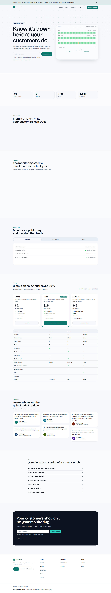
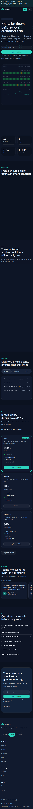

# Tidewatch: SaaS landing page (concept demo)

A launch page for Tidewatch, a fictional uptime monitor and public status page for small SaaS teams.

**This is a portfolio concept project. Tidewatch is not a real company, and the testimonials and logos are fictional.**

**Live demo:** [tidewatch-nine.vercel.app](https://tidewatch-nine.vercel.app)





<!-- TODO: replace with real screenshots after deploy -->

## Lighthouse

Mobile preset on `/` against `pnpm build && pnpm start`. Details are in [docs/lighthouse.md](docs/lighthouse.md).

| Category | Score |
| --- | --- |
| Performance | 97 |
| Accessibility | 100 |
| Best Practices | 100 |
| SEO | 100 |

The hero headline is the LCP element. CLS is 0. First-load JS for `/` is 187.3 KB gzipped. The aim was under 150 KB. React DOM and the Next.js runtime are most of that weight.

## Features

- Concept announcement bar that can be dismissed and stays dismissed in localStorage, without layout shift.
- Sticky header with section links, a light / dark / system theme control, and a mobile menu.
- Hero with an inline waitlist and an HTML status board (90-day bars, sparkline, incident toast).
- Invented wordmarks, count-up stats, a three-step explanation, and a six-card feature grid.
- Tabs for monitors, the status page, and alerts.
- Pricing for Hobby ($0), Team ($19), and Business ($49), with annual billing at 20% off and a comparison table.
- Six sample testimonials (masonry on desktop, swipeable on a phone) and a seven-question FAQ.
- Waitlist server action: zod on the client and the server, honeypot, 1.5 second minimum time, five submissions per 10 minutes per IP, and duplicate detection with `same-email`.
- Contact form that validates and redirects to `/thanks`.
- Dark mode that follows the system, persists, and does not flash.
- Scroll reveals that respect reduced motion. Hero text is visible at first paint.
- SEO: metadata, Open Graph and Twitter images, sitemap, robots, manifest, and JSON-LD for `SoftwareApplication` and `FAQPage`.

## Tech stack

Next.js (App Router), React 19, TypeScript, Tailwind CSS v4, shadcn/ui, next-themes, Motion, zod, react-hook-form, sonner, lucide-react, same-email. Optional Upstash Redis. pnpm. Node 24 on Vercel.

## Getting started

```bash
pnpm install
cp .env.example .env.local
pnpm dev
```

Other scripts: `pnpm lint`, `pnpm test`, `pnpm test:e2e`, `pnpm build`, `pnpm screenshots`.

## Env vars

| Name | Required | Example | Notes |
| --- | --- | --- | --- |
| `NEXT_PUBLIC_SITE_URL` | Yes in production | `https://tidewatch-demo.vercel.app` | metadataBase, sitemap, and social images. Falls back to `http://localhost:3000`. |
| `UPSTASH_REDIS_REST_URL` | No | `https://xxx.upstash.io` | Persist waitlist entries. Without it, storage is an in-memory Map that resets on a cold start. |
| `UPSTASH_REDIS_REST_TOKEN` | No | | Pair with the URL above. |
| `WAITLIST_WEBHOOK_URL` | No | `https://script.google.com/...` | POST each new signup to a sheet, Zapier, Make, or a CRM. |

The site builds and runs with none of the optional variables set.

## Deploy to Vercel

1. Import the repo.
2. Set `NEXT_PUBLIC_SITE_URL` to the deployment URL.
3. Optional: add Upstash Redis from the Vercel Marketplace and set the two REST variables.
4. Optional: set `WAITLIST_WEBHOOK_URL`.

No other config is required. The project targets Node 24.

## Project structure

```text
app/                routes, metadata, server actions
components/         sections and shadcn/ui
lib/                content, schemas, store, rate limit
e2e/                Playwright smoke tests and screenshots
tests/              Vitest
docs/               Lighthouse notes and screenshots
```

## Credit

Built by [Sameer Zaman](https://sameer-zaman.vercel.app), available for landing page and MVP work.
